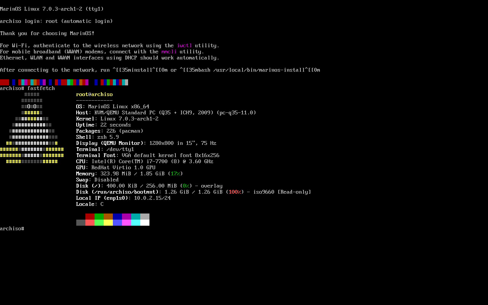

# The MarinOS Linux Distributon


#### Simple. Beautiful. Lightweight.

### Changelog (v1.1)

### Fixed the chown bug!
Fixed the chown bug that broke the .config and had to be manually fixed

### Fixed GRUB
MarinOS now appears in GRUB as MarinOS v1.1 (lil bro) instead of arch linux

### Rebranded the README.md
Made the README.md much cleaner with screenshots!


## Machine Requirements
### Minimum

RAM: 2 GB

Storage: 10 GB

Processor: 64-bit Dual Core

Internet: Required for installation (pacstrap)

### Recommended

RAM: 4 GB or more

Storage: 20 GB SSD

Processor: Quad-core or better

Graphics: ~512MB-1GB vram for dedicated gpu's. Integrated graphics will work okay.

## Installation
Get the latest ISO from the [releases](https://github.com/idkrandomuser123/marinos/releases) tab.

Burn it onto an removable device (e.g. USB stick) using rufus/etcher or ventoy (recommended)

Boot from the removable device in your motherboard's BIOS



Inside the live enviroment, run the guided installer with:
```
install
```

After the installation you will be prompted to SDDM. After loging in you should see the beautiful desktop prepared by us!

If you want to change your wallpaper, see [post installation](https://github.com/idkrandomuser123/marinos/wiki/Post-installation) 
